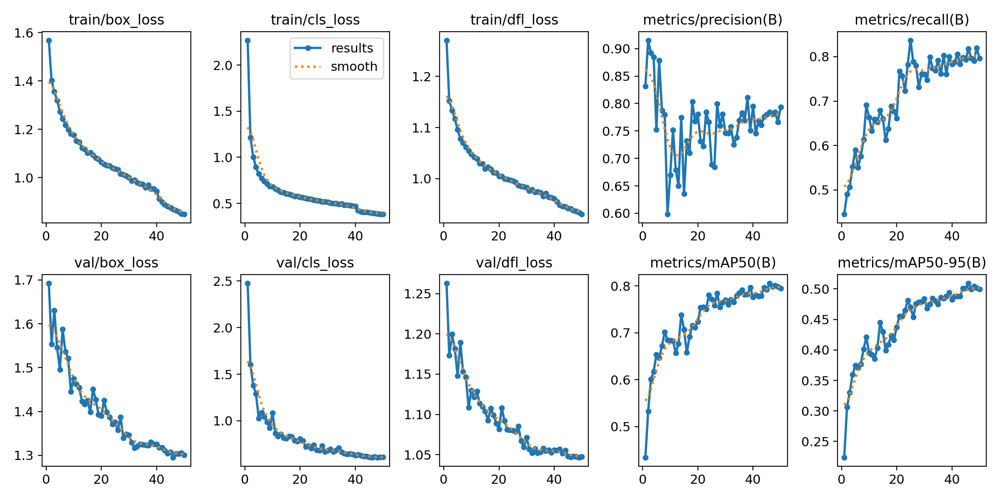
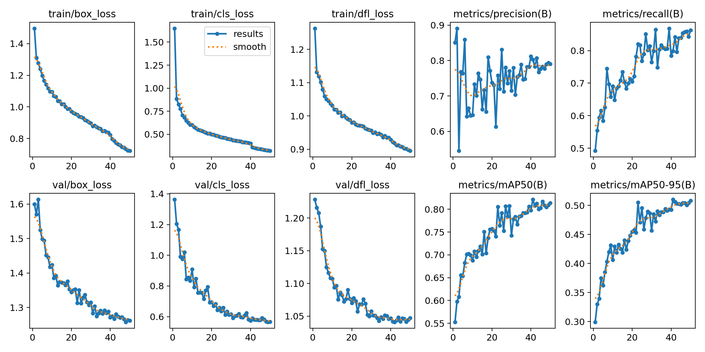
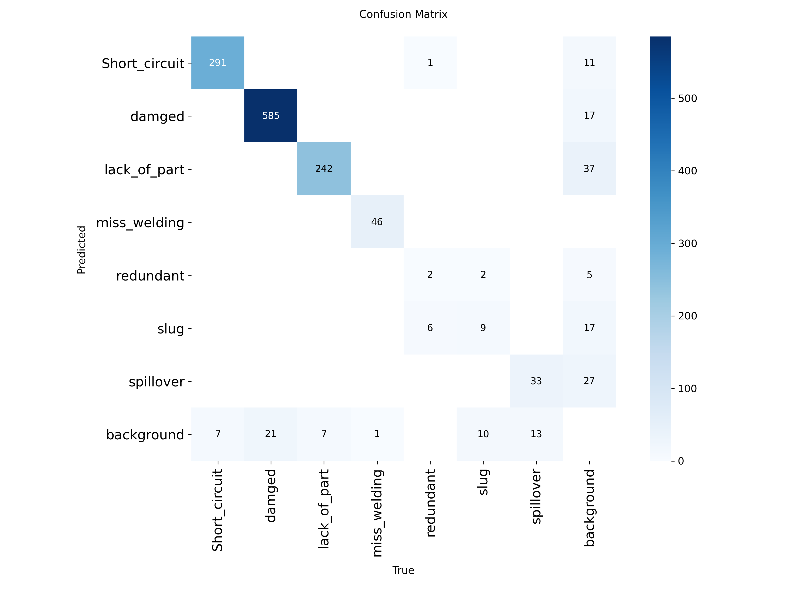
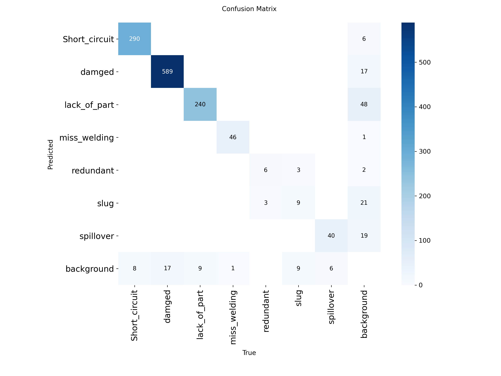
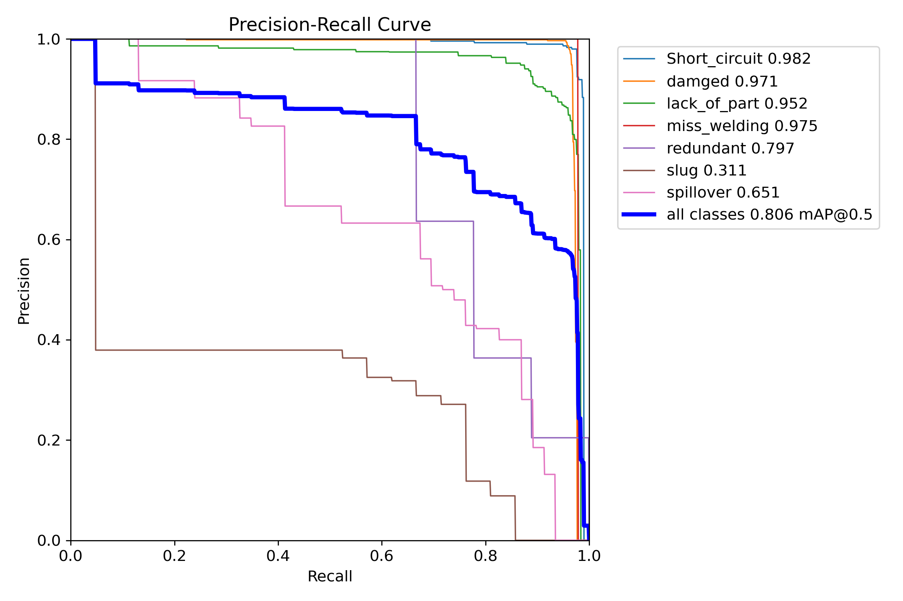
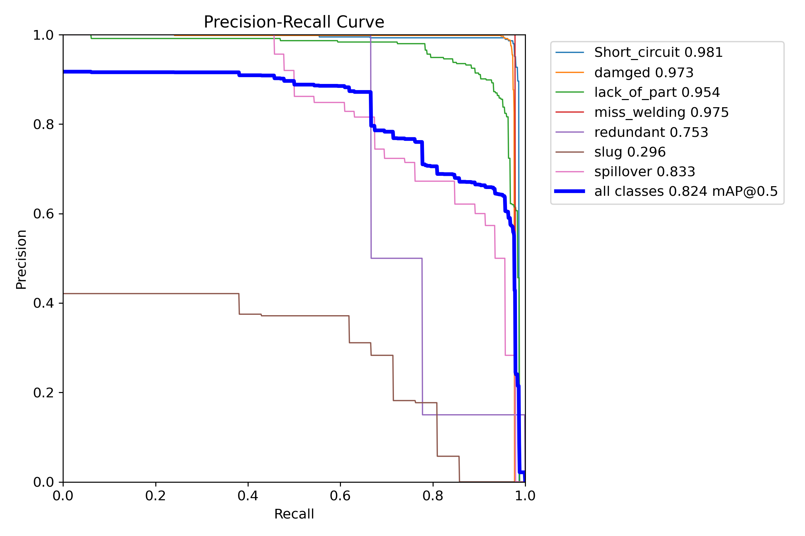
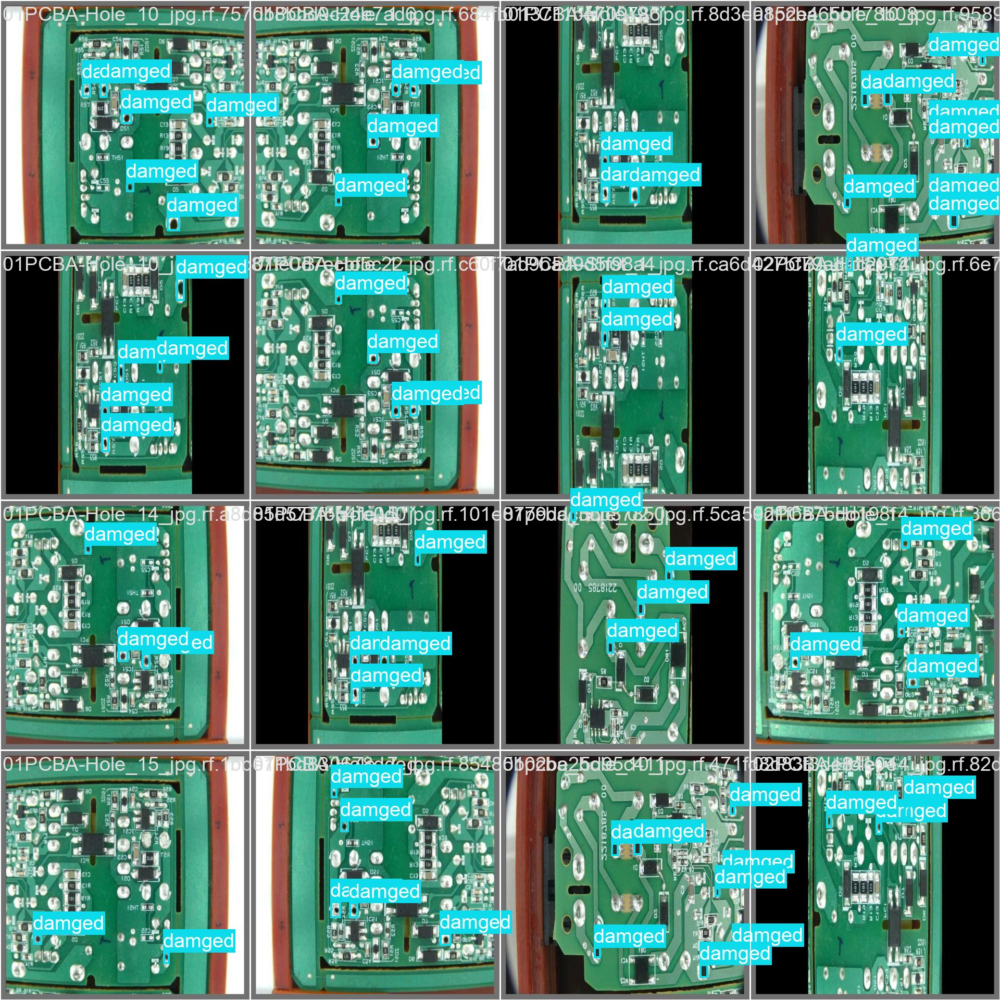

# 基于 YOLOv8 的 PCB 缺陷检测系统

使用 [YOLOv8](https://github.com/ultralytics/ultralytics) 对印刷电路板（PCB）表面的制造缺陷进行自动检测与分类。本项目为毕业设计课题，包含完整的数据集说明、训练脚本、对比实验结果与训练好的模型权重。

## 项目简介

PCB 在生产过程中会产生短路、缺件、虚焊等缺陷，传统人工目检效率低、易漏检。本项目训练 YOLOv8 目标检测模型，输入一张 PCB 图像即可一次性框出所有缺陷的位置、类别与置信度，兼顾检测精度与速度，适合产线实时部署。

## 数据集

数据来自 Roboflow Universe 的 [PCB Defect](https://universe.roboflow.com/) 公开数据集（CC BY 4.0 协议），共 **4400 张**图像，包含 **7 类**缺陷：

| 类别 | 含义 |
| --- | --- |
| Short_circuit | 短路 |
| damaged | 元器件损坏 |
| lack_of_part | 缺少零件 |
| miss_welding | 漏焊 / 虚焊 |
| redundant | 多余物 |
| slug | 锡渣 |
| spillover | 焊锡溢出 |

> 数据集体积较大，未随仓库提交。请自行从 Roboflow 下载 YOLOv8 格式后，按 `data/pcb.yaml` 中的路径放置。

## 实验环境

| 项目 | 配置 |
| --- | --- |
| 平台 | 阿里云 PAI-DSW |
| GPU | NVIDIA A10（24 GB 显存） |
| 框架 | PyTorch 2.10.0 + CUDA 12.8 |
| 检测库 | Ultralytics 8.4.x |
| Python | 3.12 |

## 快速开始

```bash
# 1. 安装依赖
pip install -r requirements.txt

# 2. 训练（默认 YOLOv8n，可用 --model yolov8s.pt 切换）
python scripts/train.py --model yolov8n.pt --epochs 50

# 3. 用训练好的权重做推理
python scripts/predict.py --weights weights/yolov8n_best.pt --source 你的图片.jpg
```

## 在线演示

上传一张 PCB 图像，即可实时框出缺陷位置、类别与数量，并可调节置信度阈值。提供三种使用方式：

**1. 在线体验（Streamlit Cloud，永久链接）**

本演示已部署到 Streamlit Community Cloud，打开即用，无需安装任何环境。

👉 在线体验地址：<https://pcb-defect-detection-yolov8-4zjx6ozj6chmptmchgflcc.streamlit.app/>

**2. 答辩备用（Google Colab，临时链接）**

仓库附带 `demo_colab.ipynb`。在 [Colab](https://colab.research.google.com/) 中打开该笔记本，依次运行各单元格（或 Runtime → Run all），最后一个单元格会输出一个 `*.gradio.live` 临时公网链接，72 小时内有效，适合答辩当天现场演示。

**3. 本地运行（Gradio）**

```bash
pip install -r requirements.txt
python app.py
# 浏览器打开 http://127.0.0.1:7860
```

**Streamlit Cloud 部署步骤**：访问 [share.streamlit.io](https://share.streamlit.io) → 用 GitHub 登录 → New app → 选择仓库 `jkjkjk699/PCB-Defect-Detection-YOLOv8`、分支 `main`、Main file path 填 `streamlit_app.py` → Deploy。几分钟后即可获得永久公网链接。

## 实验结果

在相同数据集与训练配置下，对比 YOLOv8n（nano）与 YOLOv8s（small）两种规模模型，均训练 50 轮，输入尺寸 640×640：

| 模型 | 参数量 | 计算量 | Precision | Recall | mAP50 | mAP50-95 |
| --- | --- | --- | --- | --- | --- | --- |
| YOLOv8n | 3.01 M | 8.2 GFLOPs | 0.784 | 0.818 | 0.806 | 0.509 |
| YOLOv8s | 11.13 M | 28.7 GFLOPs | 0.803 | 0.799 | 0.821 | 0.510 |

**训练曲线**

| YOLOv8n | YOLOv8s |
| :---: | :---: |
|  |  |

**混淆矩阵**

| YOLOv8n | YOLOv8s |
| :---: | :---: |
|  |  |

**PR 曲线**

| YOLOv8n | YOLOv8s |
| :---: | :---: |
|  |  |

**检测效果示例（YOLOv8n 验证集）**

<p align="center">
  
</p>

## 结论

YOLOv8s 相比 YOLOv8n，mAP50 仅提升约 **1.5 个百分点**，但参数量与计算量分别增至约 **3.7 倍**和 **3.5 倍**。精度未随模型规模显著增长，说明当前瓶颈在于**数据量不足**而非模型容量——数据集中锡渣（slug）、多余物（redundant）等类别样本极少（不足 10 个），导致模型难以充分学习。后续工作的重点应是扩充稀缺类别样本，而非单纯增大模型。

## 项目结构

```
PCB-Defect-Detection-YOLOv8/
├── README.md
├── LICENSE                   # MIT 开源协议
├── requirements.txt
├── app.py                    # Gradio 本地演示
├── streamlit_app.py          # Streamlit Cloud 在线演示
├── demo_colab.ipynb          # Google Colab 答辩备用演示
├── data/
│   └── pcb.yaml              # 数据集配置（需修改为本机路径）
├── scripts/
│   ├── train.py              # 训练脚本
│   └── predict.py            # 推理脚本
├── results/
│   ├── yolov8n/              # YOLOv8n 训练结果
│   └── yolov8s/              # YOLOv8s 训练结果
└── weights/
    ├── yolov8n_best.pt       # YOLOv8n 最优权重
    └── yolov8s_best.pt       # YOLOv8s 最优权重
```

## 参考

- Ultralytics YOLOv8: https://github.com/ultralytics/ultralytics
- 数据集来源: Roboflow Universe（CC BY 4.0）
